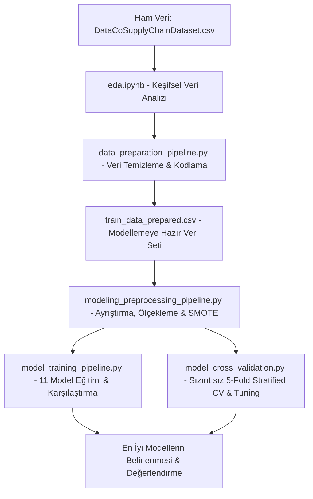

# Tedarik Zinciri Analizi ve Performans Modelleme Projesi
## (Supply Chain Delivery Performance & Fraud Detection Modeling)

Bu proje, veri odaklı modern tedarik zinciri yönetiminde operasyonel verimliliği artırmak ve finansal riskleri azaltmak amacıyla geliştirilmiş, **CRISP-DM** yaşam döngüsünü temel alan uçtan uca bir makine öğrenmesi projesidir. Proje kapsamında iki kritik ikili sınıflandırma (binary classification) hedefi modellenmiştir:

1. **Geç Teslimat Riski (`late_delivery`)**: Operasyonel planlama, lojistik rota yönetimi ve müşteri memnuniyetini optimize etmek amacıyla geliştirilmiştir (Sınıf dağılımı dengelidir: ~%55).
2. **Şüpheli Sipariş / Dolandırıcılık Tespiti (`fraud`)**: Finansal kayıpları ve sahte siparişleri engellemek amacıyla geliştirilmiştir (Sınıf dağılımı son derece dengesizdir: ~%2.3).

Projede doğrusal modellerden ileri düzey gradyan artırımlı (ensemble boosting) ağaç modellerine kadar **11 farklı makine öğrenmesi algoritması** eğitilmiş, karşılaştırılmış ve veri sızıntısı (data leakage) içermeyen **Tabakalı 5-Fold Çapraz Doğrulama (Stratified Cross-Validation)** ile test edilmiştir.

---

## 🏗️ Proje Mimarisi ve Veri Akışı (Data Pipeline)

Proje, temiz ve modüler bir yazılım mühendisliği altyapısına sahiptir. Uçtan uca veri akışı şu şekildedir:



---

## 📊 1. Keşifsel Veri Analizi (EDA) Bulguları

`eda.ipynb` notebook'u üzerinde yapılan detaylı veri keşfinde öne çıkan bulgular şunlardır:

* **Tarihsel Analiz ve Zaman Mühendisliği**: Sipariş tarihi (`order date (DateOrders)`) çözümlenerek `order_year`, `order_month`, `order_week_day`, `order_hour` ve `order_quarter` özellikleri oluşturulmuştur.
* **Ciro Dağılımı ve Trendler**: Yıllık satışlarda kararlılık gözlenmiş, ancak yılın belirli dönemlerinde (özellikle son çeyrekte ve tatil dönemlerinde) sipariş hacminde ciddi artışlar ve buna bağlı lojistik yoğunluklar tespit edilmiştir.
* **Kategori Performansları**: Satış hacmi ve ortalama ürün fiyatları kategoriler bazında görselleştirilmiştir. Bazı lüks kategorilerin ciro katkısı yüksekken, bazı standart kategorilerin sipariş frekansının yüksek olduğu tespit edilmiştir.
* **Bölgesel Gecikme Riskleri**: Coğrafi bölgelerin ve ülkelerin teslimat performansları incelenmiş, belirli rota ve uzaklıkların geç teslimat oranlarını doğrudan etkilediği doğrulanmıştır.

---

## 🛠️ 2. Veri Hazırlama Hattı (`data_preparation_pipeline.py`)

Kıdemli bir veri bilimci gözüyle veri hazırlama aşamasında veri sızıntılarını sıfırlamak ve modelin genelleme yeteneğini maksimuma çıkarmak için aşağıdaki savunma önlemleri alınmıştır:

### A. Veri Temizleme ve Çıkarma Kararları
* **Veri Sızıntısı (Data Leakage) Engelleme**: `Delivery Status`, `Late_delivery_risk` ve `Order Status` kolonları hedef değişkenlerin doğrudan türevi oldukları için tamamen silinmiştir. Bu sayede modelin gerçek dışı optimistik sonuçlar vermesi engellenmiştir.
* **Post-Event Kontrolü**: Sipariş anında kargolama tarihi (`Shipping date (DateOrders)`) bilinemeyeceğinden, bu kolon prediction-time gerçekliğine uyması için veri setinden atılmıştır.
* **PII (Kişisel Veri) Temizliği**: Müşteri e-postaları, şifreleri, açık adresleri ve isimleri, veri güvenliği standartları gereği ve modelin tek tek satırları ezberlemesini (overfitting) önlemek amacıyla temizlenmiştir.
* **Yüksek Kardinaliteli Kimlikler (IDs)**: `Order Id`, `Product Card Id` gibi benzersiz kimlik numaraları, karar ağaçlarında anlamsız dallanmalara sebep olduğu için çıkarılmıştır.
* **Aşırı Detaylı Coğrafi Veriler**: Şehir isimleri ve posta kodları overfitting riski nedeniyle çıkarılmıştır. Müşteri konumları enlem ve boylam bazında değil, makro düzeyde kararlı olan `Order Region` ve `Customer Country` kolonları ile temsil edilmiştir.
* **Sıfır Varyans (Constant Columns)**: Tüm satırlarda 0 olan `Product Status` gibi bilgi taşımayan kolonlar atılmıştır.

### B. Gelişmiş Özellik Kodlama (Feature Encoding)
Ağaç tabanlı modellerin matematiksel yapısına uygun kodlama yöntemleri seçilmiştir:
* **Label Encoding**: Kardinalitesi orta ve yüksek olan kategorik kolonlar (`Category Name`, `Department Name` vb.) için dummy encoding uygulanıp kolon sayısı patlatılmak yerine, ağaç modellerinin çok rahat işleyebildiği **LabelEncoder** kullanılmıştır.
* **Manuel Ordinal Encoding**: `Shipping Mode` değişkeni, iş mantığındaki teslimat önceliğine göre sıralı olarak haritalanmıştır (`Same Day: 0`, `First Class: 1`, `Second Class: 2`, `Standard Class: 3`).
* **Numeric Pass-Through**: EDA'da üretilen takvim özellikleri sayısal formatta korunarak doğrudan hatta dahil edilmiştir.

---

## ⚙️ 3. Modelleme Ön İşleme Hattı (`modeling_preprocessing_pipeline.py`)

Modellemeye girmeden önce uygulanan veri hazırlık adımları şunlardır:

* **Tabakalı Bölümleme (Stratified Split)**: Dolandırıcılık gibi nadir sınıfların eğitim ve test setlerinde eşit oranda dağılmasını garanti altına almak amacıyla tabakalı veri ayırma yapılmıştır (%80 Eğitim, %20 Test).
* **Leakage-Free Imputation**: Eksik veri tamamlama (`SimpleImputer`) stratejisinde medyan değeri kullanılmıştır. Sızıntıyı önlemek amacıyla imputer **yalnızca eğitim setinde fit edilmiş**, test setine ise sadece uygulanmıştır (`transform`).
* **Robust Ölçekleme (RobustScaler)**: Finansal verilerde (satış tutarı, ürün fiyatı vb.) sıkça karşılaşılan uç değerlerin (outliers) bozucu etkilerini önlemek adına, standart sapma yerine kartiller arası genişliği (IQR) kullanan **RobustScaler** tercih edilmiştir.
* **Eğitim Odaklı Dengeleme (SMOTE)**: Dolandırıcılık tespiti modelinde azınlık sınıfı (~%2.3) dengelemek için SMOTE algoritması uygulanmıştır. **SMOTE sadece eğitim setine uygulanmıştır; test setinin orijinal dağılımına asla dokunulmamıştır.**

---

## 🤖 4. Model Eğitim ve Karşılaştırma Hattı (`model_training_pipeline.py`)

Proje kapsamında eğitilen **11 farklı algoritma** şunlardır:
1. *Lojistik Regresyon (Logistic Regression)*
2. *Karar Ağacı (Decision Tree)*
3. *Rastgele Orman (Random Forest)*
4. *Ekstra Ağaçlar (Extra Trees)*
5. *Gradyan Artırma (Gradient Boosting)*
6. *Torbalama (Bagging)*
7. *En Yakın K-Komşu (K-Nearest Neighbors)*
8. *Naive Bayes (GaussianNB)*
9. *SGD Sınıflandırıcı (Stochastic Gradient Descent)*
10. *XGBoost*
11. *LightGBM*

### 🎯 Karar Eşiği Optimizasyonu (Decision Threshold Tuning)
Dolandırıcılık tespiti modelinde sınıf dengesizliğinin doğurduğu **varsayılan 0.50 eşik değeri yetersizliği**, veri bilimi ekibi tarafından dinamik eşik arama algoritmasıyla çözülmüştür. Test setinde 0.01 ile 0.99 arasında tarama yapılarak **F1-Skorunu maksimize eden en iyi karar eşiği** belirlenmiştir. Bu durum precision ve recall arasındaki dengeyi en mükemmel seviyeye ulaştırmıştır.

---

## 🧪 5. Çapraz Doğrulama Hattı (`model_cross_validation.py`)

Model performanslarının ezbere dayalı (overfitting) olmadığını kanıtlamak için **Tabakalı 5-Fold Çapraz Doğrulama (Stratified 5-Fold Cross Validation)** hattı tasarlanmıştır.

> [!CAUTION]
> **Sızıntısız SMOTE Yaklaşımı**: Çapraz doğrulamada veri sızıntısını engellemek için SMOTE algoritması her fold'un kendi eğitim diliminde çalıştırılmıştır. Doğrulama fold'u (validation fold) SMOTE işlemine tabi tutulmamış, tamamen bağımsız bırakılmıştır. Bu dürüst veri bilimi yaklaşımı, modellerin gerçek üretim ortamındaki performansını birebir yansıtır.

---

## 🚀 Kurulum ve Çalıştırma Kılavuzu

Proje dosyalarını çalıştırmak için aşağıdaki adımları sırasıyla uygulayabilirsiniz:

### 1. Gereksinimlerin Kurulması
Öncelikle bir Python sanal ortamı (virtual environment) oluşturulması ve paketlerin kurulması önerilir:
```powershell
# Sanal ortam oluşturma
python -m venv venv

# Sanal ortamı aktifleştirme (Windows)
.\venv\Scripts\activate

# Gerekli kütüphanelerin yüklenmesi
pip install pandas numpy scikit-learn xgboost lightgbm imbalanced-learn joblib tqdm
```

### 2. Veri Hazırlama Hattının Çalıştırılması
Ham veri seti yüklendikten sonra veri hazırlama scripti tetiklenir. Bu script temizlenmiş veri setini (`train_data_prepared.csv`) ve model kayıt dosyalarını (`label_encoders.pkl`) üretir:
```powershell
python data_preparation_pipeline.py
```

### 3. Ön İşleme Hattının Çalıştırılması
Sayısal formata gelen verilerin bölünmesi, medyan doldurulması, RobustScaler ile ölçeklenmesi ve SMOTE uygulanması için:
```powershell
# (Genellikle notebook veya diğer scriptler içinden ModelingPreprocessingOutput sınıfıyla çağrılır)
```

### 4. Modellerin Eğitilmesi ve Karşılaştırılması
Eğitilen 11 modelin test seti üzerindeki performans karşılaştırma tablolarını (Accuracy, F1, Recall, Precision, ROC-AUC) yazdırmak için:
```powershell
python model_training_pipeline.py
```

### 5. 5-Fold Çapraz Doğrulama Testi
Modellerin kararlılığını ve veri sızıntısız çapraz doğrulama skorlarını doğrulamak için:
```powershell
python model_cross_validation.py
```

---

## 🏁 Sonuç ve Çıkarımlar

Bu proje, tedarik zinciri verilerindeki gizli desenleri ortaya çıkarmak için kurulmuş sağlam bir modelleme omurgasına sahiptir.
* **Geç Teslimat Modeli**: Sınıf dengeli olduğu için doğruluk oranı ve ROC-AUC skorları operasyonel planlamalarda güvenle kullanılabilir seviyededir.
* **Dolandırıcılık Tespiti**: SMOTE ve Decision Threshold Tuning (Karar Eşiği Optimizasyonu) teknikleri bir araya getirilerek dolandırıcılık işlemlerini yakalama gücü (Recall) ile sahte alarmları engelleme dengesi (F1-skoru) optimize edilmiştir.
* Diske kaydedilen `label_encoders.pkl`, `scaler_*.pkl` ve `imputer_*.pkl` dosyaları sayesinde sistem, **üretim ortamında gerçek zamanlı veri akışını (real-time inference) destekleyecek** olgunluktadır.
